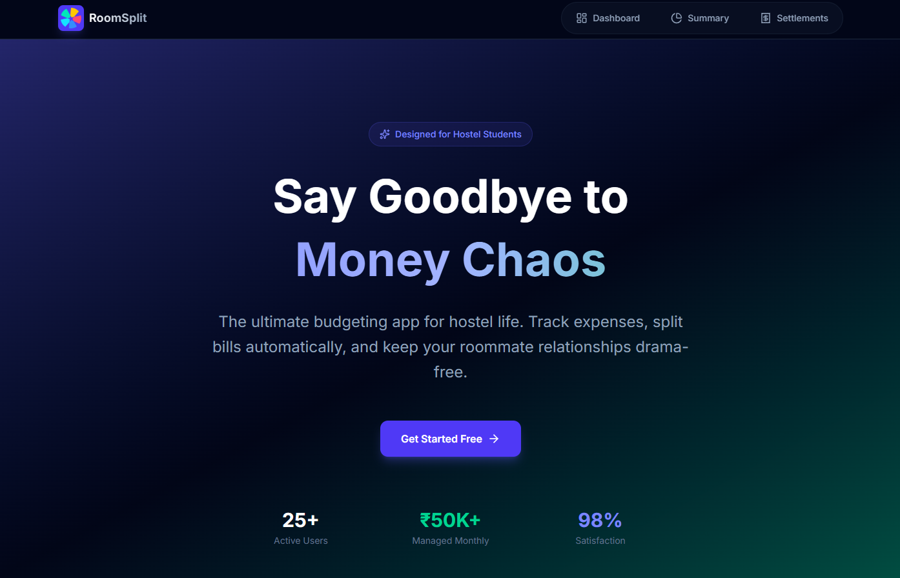
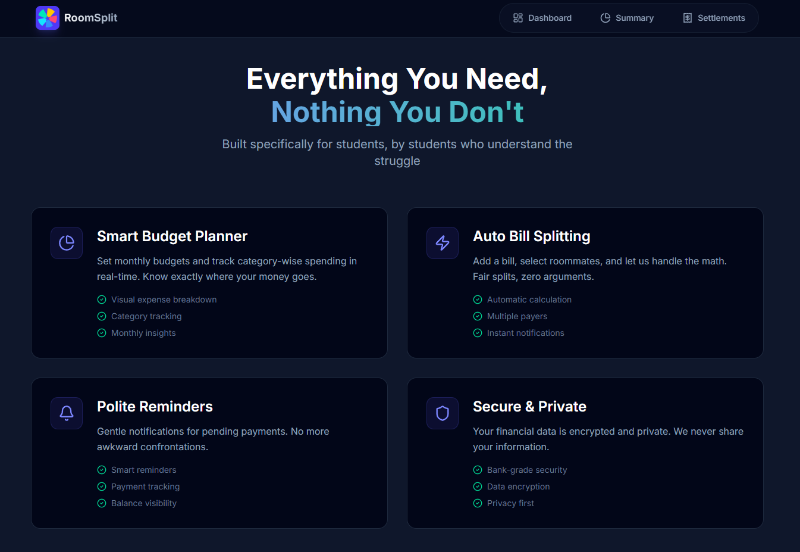
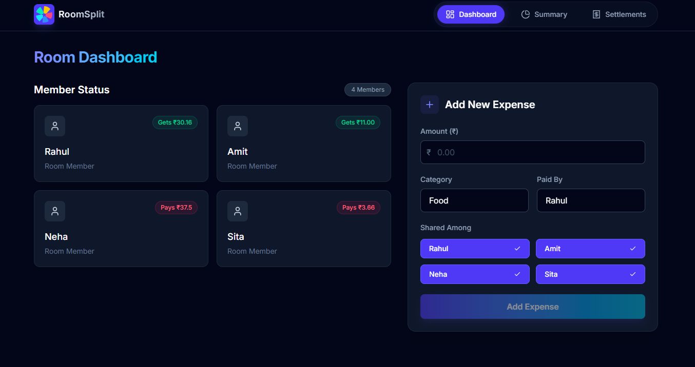
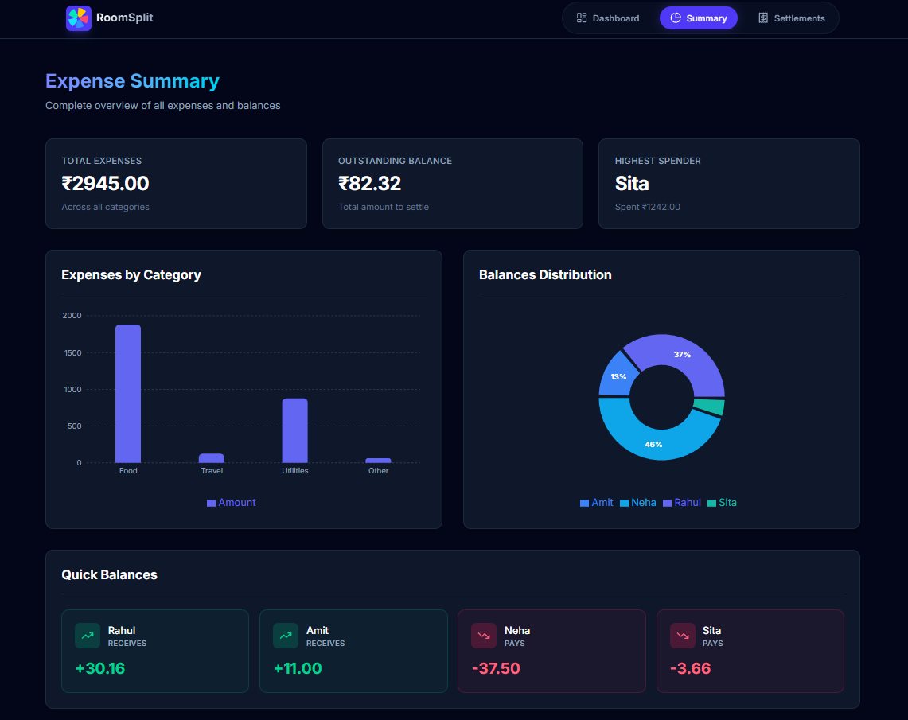
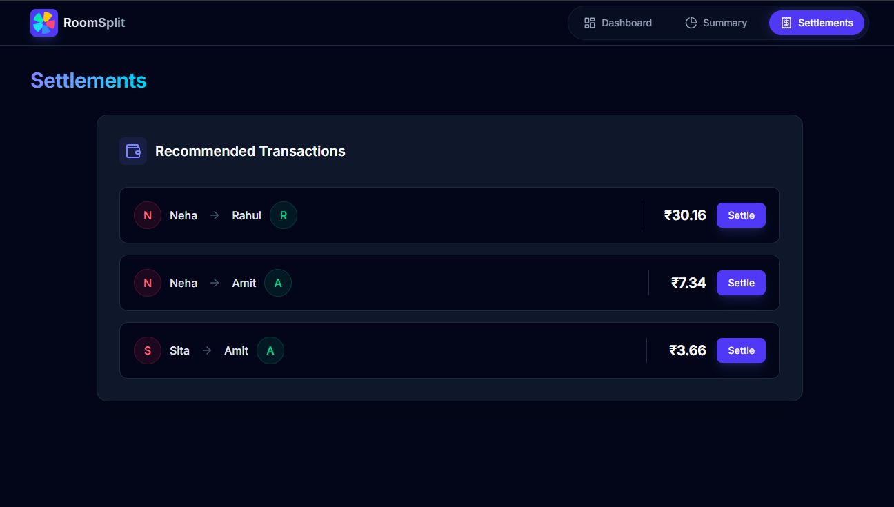

# 💰 RoomSplit - Hostel Life Utility Manager

<div align="center">



**Say Goodbye to Money Chaos**

A modern, student-friendly budgeting app designed for hostel life. Track expenses, split bills automatically, and maintain harmony among roommates.

[](https://roomsplit-demo.vercel.app/)
[](https://github.com/KeshavAjagaonkar/RoomSplit)

</div>

---

## 📸 Screenshots

### Landing Page
<div align="center">
  
</div>

### Feature Section
<div align="center">
  
</div>

### Dashboard
<div align="center">
  
</div>

### Summary
<div align="center">
  
</div>

### Settlements
<div align="center">
  
</div>

---

## 🎯 Problem Statement

Managing expenses in hostel life is chaotic - students struggle with budgeting, splitting bills, and tracking payments. This leads to end-of-month shortages and conflicts among roommates.

**RoomSplit solves this by providing:**
- 📊 Monthly budget planning
- 💸 Category-wise expense tracking
- ✂️ Auto-split bills among roommates
- 🔔 Payment reminders
- 📈 Clear visual breakdowns

---

## ✨ Features

- **Smart Budget Tracker** - Plan monthly expenses and track category-wise spending
- **Auto Bill Splitting** - Fair share calculation with multiple payer support
- **Balance Management** - Clear visibility of who owes what
- **Clean UI/UX** - Dark theme with smooth animations and responsive design

---

## 🛠️ Tech Stack

- React 18 + Vite
- React Router DOM
- Framer Motion
- Tailwind CSS
- Lucide React Icons

---

## 🚀 Quick Start

```bash
# Clone repository
git clone https://github.com/KeshavAjagaonkar/RoomSplit
cd RoomSplit

# Install dependencies
npm install

# Run development server
npm run dev

# Build for production
npm run build
```

---

## 📁 Project Structure

```
RoomSplit/
├── public/
│   ├── index.html
│   └── logo.png
├── src/
│   ├── components/
│   │   ├── _SummaryComponents/
│   │   │   ├── BalanceCard.jsx
│   │   │   ├── BarChart.jsx
│   │   │   ├── ChartSection.jsx
│   │   │   ├── EmptyState.jsx
│   │   │   ├── PieComponent.jsx
│   │   │   └── SummaryCard.jsx
│   │   ├── dashboard/
│   │   │   └── MemberCard.jsx
│   │   ├── Layout/
│   │   │   ├── Nav.jsx
│   │   │   └── PageContainer.jsx
│   │   └── AddExpense.jsx
│   ├── constants/
│   │   ├── categories.js
│   │   └── index.js
│   ├── data/
│   │   └── member.js
│   ├── hooks/
│   │   └── useLocalStorage.js
│   ├── pages/
│   │   ├── Dashboard.jsx
│   │   ├── Home.jsx
│   │   ├── Settlements.jsx
│   │   └── Summary.jsx
│   ├── utils/
│   │   ├── computeBalances.js
│   │   ├── computeSettlements.js
│   │   ├── getCategoryData.js
│   │   ├── getHighestSpender.js
│   │   ├── getMemberName.js
│   │   └── totalExpenses_Balance.js
│   ├── App.jsx
│   ├── index.css
│   └── main.jsx
├── .gitignore
├── eslint.config.js
├── index.html
├── package-lock.json
├── package.json
├── postcss.config.js
├── README.md
├── vercel.json
└── vite.config.js
```

---

## 🎨 Color Palette

- **Primary**: Indigo (#6366f1)
- **Success**: Emerald (#34d399)
- **Error**: Rose (#fb7185)
- **Background**: Slate (#020617)

---

## 📄 License

MIT License - see [LICENSE](./LICENSE) for details

---

## 👨‍💻 Author

**Keshav Ajagaonkar**

- GitHub: [@KeshavAjagaonkar](https://github.com/KeshavAjagaonkar)

**Prashanth Naidu**

- GitHub: [@AvatarN03](https://github.com/AvatarN03)

**Harshad Shinde**

- GitHub: [@harshh3400](https://github.com/harshh3400)

---

<div align="center">

**Made with ❤️ for hostel students**

[⬆ Back to Top](#-roomsplit---hostel-life-utility-manager)

</div>